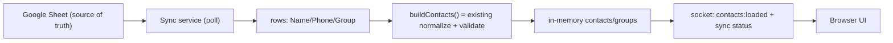

# Google Sheets Synchronization — Design & Recommendation

Design only. No code, no project changes. The goal is to reduce office-staff work while staying reliable and simple to operate.

## 1. Integration with the current app

The existing pipeline already separates "get rows" from "turn rows into contacts". In [src/excel.js](src/excel.js) lines 44-71, each `{Name, Phone, Group}` row is validated, normalized via [src/phone.js](src/phone.js), and pushed into an in-memory store exposed by `getContacts()` / `getGroups()`. The server then broadcasts `contacts:loaded` over the socket (see [src/server.js](src/server.js)).

A Sheets sync changes only the **source of the rows**. Everything downstream (validation, phone normalization, in-memory store, socket broadcast, selection UI) stays identical. The clean refactor is to extract the row-to-contact loop into a shared `buildContacts(rows)` function that both the existing upload path and the new sync path call.

## 2. Approach comparison

- **Manual refresh button**
  - Complexity: very low. Reliability: high. Maintenance: very low. UX: still a manual click, but no export/upload. Risks: staff forget to click; data goes stale. Effort: ~0.5 day.
- **Scheduled polling (recommended)**
  - Complexity: low. Reliability: high (no inbound network needed). Maintenance: low. UX: fully automatic; small delay (poll interval) between edit and refresh. Risks: API quota if interval too aggressive; mitigated by checking modified-time first. Effort: ~2-3 days.
- **Google Drive change detection (modifiedTime polling)**
  - This is an optimization of polling: cheap `files.get(fields=modifiedTime)` call, only fetch full cell data when the timestamp advances. Complexity: low-medium. Reliability: high. Maintenance: low. UX: automatic. Risks: minimal. Effort: +0.5 day on top of polling.
- **Webhooks / push notifications (Drive `files.watch`)**
  - Complexity: high. Reliability: medium (channels expire ~hours/days and must be renewed; Google requires re-registration). Maintenance: high. UX: near real-time. Risks: requires a publicly reachable HTTPS endpoint with a valid domain/cert — the tool currently runs on `localhost` for a single user, so this needs a tunnel or hosting. Effort: ~5-7 days plus ongoing ops. Not justified for a single-user local tool.
- **Google Sheets API direct read**
  - Not a sync strategy on its own; it is the data-fetch mechanism used by polling/webhooks for private sheets. Reliable, well-documented.
- **Published-to-web CSV polling**
  - Complexity: lowest (no Google Cloud project, no credentials — just fetch a CSV URL on a timer). Reliability: high. Maintenance: lowest. UX: automatic. Risks: requires "publish to web"/"anyone with link", which exposes member phone numbers (PII) to anyone who discovers the URL. Effort: ~1-2 days. Good fallback if the sheet may be public, but privacy is the deciding factor.

## 3. Recommendation

**Scheduled polling of a private sheet using a Google service account, with modified-time change detection.**

Rationale for a small internal tool with contact PII:
- Zero ongoing staff action: edits in the sheet appear automatically.
- No public endpoint required — works with the current local single-user model (unlike webhooks).
- Keeps the contact list private (service account shared only with that one sheet), unlike publish-to-web CSV.
- Cheap: poll `modifiedTime` (a tiny call) every ~60s; only pull full rows when it changes.
- Reuses the entire existing normalization/UI pipeline.

If privacy is explicitly not a concern and the team wants the absolute minimum setup, the published-CSV variant is the lighter alternative; otherwise the service-account approach is preferred.

## 4. Technical definition

- **Required Google services/APIs**
  - Google Sheets API (read cell values: `spreadsheets.values.get`).
  - Google Drive API (read `modifiedTime` for change detection: `files.get`).
  - A Google Cloud project with both APIs enabled.
- **Authentication**
  - A **service account** (JSON key stored locally, git-ignored like `.wwebjs_auth/`). The office staff shares the Google Sheet with the service account's email (Viewer). No interactive OAuth, no per-user login, no token refresh UI. This is the lowest-friction auth for an unattended single-purpose tool.
  - Configuration (sheet ID, poll interval, credentials path) lives in [src/config.js](src/config.js) / an env file, consistent with the existing `DEFAULT_COUNTRY_CODE` pattern and the backlog "configurable settings" item.
- **Data flow**
  - On startup and every interval: call Drive `files.get(modifiedTime)`. If unchanged since last sync, do nothing. If changed (or first run), call Sheets `values.get`, map rows to `{name, phone, group}`, run `buildContacts()`, replace the in-memory store, and broadcast `contacts:loaded` plus a `sync:status` event.
- **Failure handling**
  - On any API error (network, auth, quota), keep serving the last successfully cached contacts and emit a `sync:status` of `error` with a message. Never wipe good data because of a failed poll.
  - Cache the last good rows to local disk so a restart during an outage still has data (ties into the backlog "persist locally / reload on startup" item).
  - Exponential backoff on repeated failures to avoid hammering the API.
- **Sync monitoring (UI)**
  - Status bar showing: connected sheet name, last successful sync time, and current status (`Connected` / `Syncing` / `Error: ...`). This matches the backlog UX requirement.
- **Recovery procedures**
  - Manual "Sync now" button to force an immediate poll (also covers the impatient-staff case).
  - If credentials/sheet sharing break, the UI error state tells staff exactly what to fix (re-share sheet with the service-account email). Document this in the README troubleshooting table.
  - Fallback to manual Excel upload remains available as a break-glass path.

## 5. Handling contact/group changes

Because each sync **fully rebuilds** the in-memory list from the current sheet contents, all change types are handled uniformly with no diffing logic:
- **Updated contact** (name/phone/group edited): the row is re-normalized; the new value replaces the old on next sync.
- **New contact** (row added): appears as a new contact/group automatically.
- **Deleted contact** (row removed): disappears from the in-memory list on next sync.
- **Group changes** (renamed/added/removed in the `Group` column): groups are recomputed from the column each sync (same `[...new Set(...)].sort()` logic), so the selection UI updates automatically.
- **Edge case — active selection/send:** if a sync arrives while staff are mid-selection or a campaign is sending, do not silently swap data underneath them. Defer the refresh until the send completes, and after refresh reconcile the selected `chatId` set against the new contact list (drop any that no longer exist) so a stale selection cannot send to removed contacts.
- **Data quality:** invalid/short numbers are still reported via the existing `skipped` mechanism; surface a small "N rows skipped" note in the sync status so staff can fix the sheet.

## 6. Phased rollout

- **Phase 1 — Foundation (low risk, immediate value):** refactor the row-to-contact loop in [src/excel.js](src/excel.js) into a shared `buildContacts(rows)`; add read-only Sheets connectivity behind config; add a manual "Sync now" button that pulls the sheet once and reuses the existing `contacts:loaded` flow. Upload still available. Proves auth + parsing end to end.
- **Phase 2 — Automatic polling + monitoring:** add interval polling with `modifiedTime` change detection, the sync-status UI (connected sheet, last sync, status), failure handling with last-good caching, and backoff. Manual upload becomes the fallback.
- **Phase 3 — Hardening & optional push:** disk-persist last good data for restart resilience; selection/send reconciliation on refresh; README ops/troubleshooting docs. Optionally evaluate Drive `files.watch` webhooks only if near-real-time updates become a real requirement and a hosted/public endpoint exists.

## 7. Rough effort

- Phase 1: ~2-3 days (incl. Google Cloud project + service account setup).
- Phase 2: ~2-3 days.
- Phase 3: ~1-2 days (webhook spike excluded).

## Open decision for the user

The recommendation assumes the sheet stays **private** (service account). If the team is comfortable publishing the sheet to the web, the CSV-polling variant is faster to build and needs no Google Cloud setup, at the cost of exposing phone numbers to anyone with the URL. Confirm the privacy preference before Phase 1.