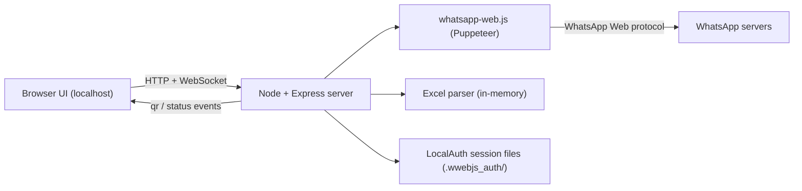

# WhatsApp Campaign Tool — Phase 1 Technical Plan

Note: There is no `PROJECT.md`; this plan is based on [README.md](README.md), which contains the spec. The repo is currently empty (greenfield).

Key interpretation: "Group" is a label in the Excel `Group` column. Recipients are always **individual phone numbers**, optionally filtered by their group label. We do not create or message WhatsApp group chats in Phase 1.

## 1. System Architecture

This is a **single-process local app** the staff member runs on their own machine. The browser UI talks to a local Node backend; the backend owns the one WhatsApp Web session.



- One backend process holds a single WhatsApp client instance (single user).
- Parsed Excel data lives **in memory** for the session only (no DB).
- WhatsApp login is persisted as session files on disk by the library's `LocalAuth` (this is a session cache, not a database) so the QR is not needed on every restart.
- Real-time QR display and delivery-status updates pushed over a WebSocket; everything else is plain REST.

## 2. Recommended Tech Stack

Goal: minimal moving parts, no build step.

- **Runtime:** Node.js (LTS).
- **Backend:** Express.
- **WhatsApp:** `whatsapp-web.js` (drives real WhatsApp Web via Puppeteer). Robust media support (images/PDF) and built-in `LocalAuth` session persistence. Best fit for "reliable + simple."
- **QR rendering:** `qrcode` (turn the emitted QR string into an image/data URL for the browser).
- **Excel parsing:** `xlsx` (SheetJS) — reads `.xlsx`/`.xls`, simple API for `Name | Phone | Group`.
- **Upload handling:** `multer` (memory storage; we only need to parse, not store).
- **Real-time:** `socket.io` for QR + per-recipient delivery status. (SSE is a lighter alternative if we want to drop a dependency.)
- **Frontend:** Plain HTML + CSS + vanilla JS served as static files by Express. No framework, no bundler — keeps it dead simple for an internal single-user tool.
- **Phone normalization:** small helper using `Phone` + a configured default country code to build WhatsApp chat IDs (`<number>@c.us`).

Considered and rejected for Phase 1: Baileys (lighter/socket-based but more code for media and session handling), React/Vite (build step overhead, unnecessary for this UI), any database.

## 3. Folder Structure

```text
Tennis-Whatsapp-Tool/
  README.md
  package.json
  .gitignore                 # ignore node_modules/, .wwebjs_auth/, .wwebjs_cache/, uploads
  src/
    server.js                # Express app + socket.io wiring, startup
    whatsapp.js              # client init, QR event, ready/auth events, sendMessage/sendMedia
    excel.js                 # parse buffer -> [{name, phone, group}], validation
    phone.js                 # normalize phone -> chatId, default country code
    sender.js                # iterate recipients, throttle, emit status per recipient
  public/
    index.html               # single-page UI (sections shown/hidden by step)
    app.js                   # frontend logic: socket, fetch calls, selection state
    styles.css
```

## 4. WhatsApp Integration Approach

- Initialize one `whatsapp-web.js` client with `LocalAuth` so the session is cached on disk.
- On `qr` event → convert string to image via `qrcode` → push to UI over WebSocket; user scans with their phone.
- On `ready`/`authenticated` → notify UI it can proceed; on `disconnected` → surface a reconnect/re-scan prompt.
- Sending: for each selected recipient build chat ID from the normalized phone and call the client's send method (text, and `MessageMedia` for image/PDF with optional caption).
- **Throttling:** send sequentially with a randomized delay between messages (e.g. a few seconds) to reduce spam/ban risk; report each result back as it happens.
- Session files (`.wwebjs_auth/`) are git-ignored.

## 5. Excel Parsing Approach

- Upload via `multer` memory storage → `xlsx.read(buffer)` → take first sheet → `sheet_to_json`.
- Expect headers `Name`, `Phone`, `Group` (case/space tolerant mapping).
- Per row: trim values, normalize phone, validate non-empty `Name`/`Phone`. Collect a list of invalid/skipped rows to display.
- Derive the **distinct group list** from the `Group` column for the selection UI; rows with empty group go into an "Ungrouped" bucket.
- Store the parsed contacts in memory keyed by an upload/session id; nothing written to disk.

## 6. UI Screens (single page, step-based sections)

1. **Connect / QR:** shows QR image, then "Connected as ..." state.
2. **Upload Excel:** file picker, parse result summary (row count, groups found, skipped/invalid rows).
3. **Select Recipients:** list of groups with checkboxes (select whole groups) + expandable per-customer checkboxes for individual selection; live count of selected recipients.
4. **Compose:** message text area + optional file attachment (image/PDF) with preview; dedupe of selected numbers.
5. **Send & Status:** progress list showing each recipient and live status (Pending → Sent/Failed) with a final summary; failures listed for retry.

## 7. Development Phases (Phase 1 broken into milestones)

- **M1 — Project skeleton:** `package.json`, deps, Express static serving, socket.io handshake, `.gitignore`.
- **M2 — WhatsApp connect:** client init, QR over socket, connected/disconnected states in UI.
- **M3 — Excel upload + parse:** upload endpoint, parsing, validation, groups summary in UI.
- **M4 — Recipient selection:** group + individual selection UI, dedupe, selected count.
- **M5 — Compose + send:** text + media attach, throttled sequential sender, per-recipient status over socket.
- **M6 — Polish:** error handling (bad file, not connected, send failures), failed-recipient retry, basic styling, README run instructions.

## 8. Risks and Limitations

- **Unofficial API:** `whatsapp-web.js` is not an official WhatsApp API; WhatsApp Web changes can break it, and bulk sending risks **account warnings/bans**. Mitigate with throttling, modest volumes, and a real (non-critical) number.
- **Session fragility:** the phone must stay online; session can drop and require re-scan.
- **Phone formatting:** numbers without country codes won't resolve — requires a configured default country code and validation.
- **Single user / local only:** no auth, no concurrency, runs on one machine (acceptable per spec).
- **In-memory data:** uploaded contacts and progress are lost on restart (acceptable: no DB by design).
- **Puppeteer/Chromium footprint:** larger install and some setup sensitivity on the host machine.
- **No delivery guarantee:** "Sent" reflects accepted-by-WhatsApp, not read receipts (Phase 1 keeps status simple).

## 9. Estimated Effort

Rough estimates for one developer.

- M1 Skeleton: ~0.5 day
- M2 WhatsApp connect + QR: ~1 day
- M3 Excel upload + parse: ~0.5–1 day
- M4 Recipient selection UI: ~1 day
- M5 Compose + throttled send + status: ~1–1.5 days
- M6 Polish / error handling / docs: ~1 day
- **Total Phase 1: ~5–6 days** (plus buffer for WhatsApp/Puppeteer environment quirks).

## Open Decision

- Frontend is planned as **vanilla HTML/JS** (no build step) for simplicity. If you'd prefer a light React setup instead, say so before implementation.