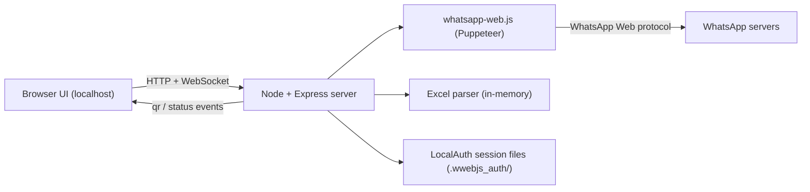

# WhatsApp Campaign Tool — Architecture & Technical Design

## Key Interpretation

"Group" is a label in the Excel `Group` column. Recipients are always **individual phone numbers**, optionally filtered by their group label. We do not create or message WhatsApp group chats in Phase 1.

---

## 1. System Architecture

This is a **single-process local app** the staff member runs on their own machine. The browser UI talks to a local Node backend; the backend owns the one WhatsApp Web session.



- One backend process holds a single WhatsApp client instance (single user).
- Parsed Excel data lives **in memory** for the session only (no DB).
- WhatsApp login is persisted as session files on disk by the library's `LocalAuth` (a session cache, not a database) so the QR is not needed on every restart.
- Real-time QR display and delivery-status updates are pushed over a WebSocket; everything else is plain REST.

---

## 2. Tech Stack

Goal: minimal moving parts, no build step.

| Concern | Choice | Reason |
|---|---|---|
| Runtime | Node.js LTS | Universal, matches whatsapp-web.js |
| Backend | Express | Minimal boilerplate |
| WhatsApp | `whatsapp-web.js` | Puppeteer-based, built-in `LocalAuth`, good media support |
| QR rendering | `qrcode` | Converts QR string to data URL for the browser |
| Excel parsing | `xlsx` (SheetJS) | Reads `.xlsx`/`.xls`, simple `sheet_to_json` API |
| File upload | `multer` (memory storage) | Parse only, nothing written to disk |
| Real-time | `socket.io` | QR push + per-recipient delivery status |
| Frontend | Vanilla HTML + CSS + JS | No build step, dead simple for single-user internal tool |
| Phone normalization | Custom helper | Normalize to `<number>@c.us` with configurable default country code |

**Considered and rejected for Phase 1:**
- Baileys — lighter but more setup for media and session handling.
- React/Vite — build step overhead not justified for this UI.
- Any database — out of scope per requirements.

---

## 3. Folder Structure

```text
Tennis-Whatsapp-Tool/
  README.md
  PROJECT.md
  ARCHITECTURE.md
  BACKLOG.md
  package.json
  .gitignore                 # node_modules/, .wwebjs_auth/, .wwebjs_cache/, uploads/
  src/
    server.js                # Express app + socket.io wiring, startup
    whatsapp.js              # Client init, QR event, ready/auth events, sendMessage/sendMedia
    excel.js                 # Parse buffer -> [{name, phone, group}], validation
    phone.js                 # Normalize phone -> chatId, configurable default country code
    sender.js                # Iterate recipients, throttle, emit status per recipient
  public/
    index.html               # Single-page UI (sections shown/hidden by step)
    app.js                   # Frontend logic: socket, fetch calls, selection state
    styles.css
```

---

## 4. WhatsApp Integration

- Initialize one `whatsapp-web.js` client with `LocalAuth` so the session is cached on disk.
- On `qr` event → convert string to an image via `qrcode` → push to UI over WebSocket; user scans with their phone.
- On `ready` / `authenticated` → notify UI it can proceed.
- On `disconnected` → surface a reconnect / re-scan prompt in the UI.
- **Sending:** for each selected recipient build a chat ID from the normalized phone number and call the client's send method (text message, or `MessageMedia` for image/PDF with optional caption).
- **Throttling:** send sequentially with a randomized delay between messages (a few seconds) to reduce spam/ban risk; report each result back via WebSocket as it happens.
- Session files (`.wwebjs_auth/`) are git-ignored and never committed.

---

## 5. Excel Parsing

- Upload via `multer` memory storage → `xlsx.read(buffer)` → take the first sheet → `sheet_to_json`.
- Expect headers `Name`, `Phone`, `Group` (case/space-tolerant mapping).
- Per row: trim values, normalize phone, validate non-empty `Name` and `Phone`. Collect invalid/skipped rows to display in the UI.
- Derive the **distinct group list** from the `Group` column for the selection UI; rows with an empty `Group` go into an "Ungrouped" bucket.
- Parsed contacts are stored in memory only; nothing is written to disk.

---

## 6. UI Screens

Single-page app; sections are shown/hidden based on the current step.

1. **Connect / QR** — shows QR image, then "Connected as ..." state.
2. **Upload Excel** — file picker, parse result summary (row count, groups found, skipped/invalid rows).
3. **Select Recipients** — list of groups with checkboxes (select whole group) + expandable per-customer checkboxes; live count of selected recipients.
4. **Compose** — message text area + optional file attachment (image/PDF) with preview; selected number deduplication shown.
5. **Send & Status** — progress list with per-recipient live status (Pending → Sent / Failed), final summary, and a list of failures for retry.

---

## 7. Implementation Milestones (Phase 1)

| Milestone | Scope | Est. Effort |
|---|---|---|
| M1 — Skeleton | `package.json`, deps, Express static serving, socket.io handshake, `.gitignore` | ~0.5 day |
| M2 — WhatsApp connect | Client init with `LocalAuth`, QR over socket, connected/disconnected states in UI | ~1 day |
| M3 — Excel upload + parse | Upload endpoint, parsing, validation, groups summary in UI | ~0.5–1 day |
| M4 — Recipient selection | Group + individual selection UI, dedupe, live selected count | ~1 day |
| M5 — Compose + send | Text + media attachment, throttled sequential sender, per-recipient status over socket | ~1–1.5 days |
| M6 — Polish | Error handling (not connected, bad file, send failures), failed-recipient retry, styling, README run instructions | ~1 day |
| **Total** | | **~5–6 days** (plus buffer for Puppeteer/environment quirks) |

---

## 8. Risks and Limitations

| Risk | Detail | Mitigation |
|---|---|---|
| Unofficial API | `whatsapp-web.js` is not an official API; WhatsApp Web changes can break it | Pin library version; monitor for updates |
| Ban risk | Bulk sending can trigger account warnings or bans | Throttle sends; use modest volumes; use a non-critical number |
| Session fragility | The phone must stay online; session can drop and require re-scan | Show clear reconnect prompt; `LocalAuth` reduces re-scan frequency |
| Phone formatting | Numbers without country codes won't resolve | Configurable default country code; validate on parse |
| Single user / local only | No auth, no concurrency, one machine | Acceptable per spec |
| In-memory data | Contacts and send progress lost on restart | Acceptable: no DB by design (backlog item for Phase 2) |
| Puppeteer footprint | Larger install, Chromium sensitivity on host machine | Document Node.js and OS prerequisites in README |
| No delivery guarantee | "Sent" = accepted by WhatsApp, not read | Clearly label status in UI |
